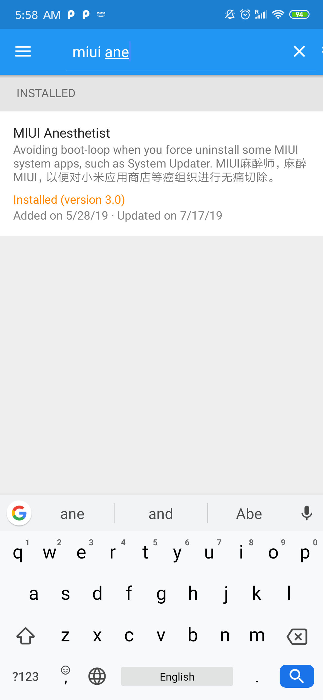

### This guide is tested working for `MIUI 10.3.17 | Stable`, on Xiaomi Redmi k20 Pro, Chinese ROM

By following this guide, you will unlock the bootloader and the following features:
 - TWRP installed, which is a recovery mode.
 - Magisk Manager intalled and is undetectable, which can do deep system tweaks.
 - EdXposed installed, which can do software and OS tweaks.
 - Enable Google Maps Location History and Location Sharing.
 - Redirect app links to Google Play Store instead of Mi App Market.
 - Prevent apps detecting root (such as Snapchat).

---

## Preparation on phone for unlock (10 minutes)

1. Go to Settings > Mi Account, and note down your mi account number and password
    Mi account number consist of a string of digits
    The password is your personal password sat by you
2. Go to Settings > Additional Settings > Developer options (google how to enable developer settings on redmi)
3. Enable OEM unlocking
4. Navigate into "Mi Unlock status" and follow the steps
5. Go to Settings > Mi Account > Mi cloud, and turn on "Find device"

    Now you phone is ready to be unlocked.

    *But your PC is probably not yet.*

## Preparation on PC for unlock (might take weeks to finish)
1. Go to https://en.miui.com/unlock/download_en.html and download the mi unlock tool. "miflash_unlock-en-3.5.910.35" version is proved working 2019/11/15
2. Unzip the file and `miflash_unlock.exe`
3. Login with your mi account number and password
4. Connect your phone to the PC and start FASTBOOT mode (holding down volume down and powerbutton)

5. You should see the following image.  

      

6. Press "Unlock" and there will be a countdown for 5 seconds. Press "Unlock anyway".  

      

7. Do it again for each popup.  
      

    If you are doing this for the first time, you will encounter a popup telling you to wait for 168 or 360 hours (or more) before attempting to unlock the phone. That's the policy of Xiaomi restricting its users from unlocking their phone, preventing criminals from unlocking stolen phones. There are no other way around, you will just have to wait for 1 or 2 weeks and retry.

8. The unlocking process starts.  
      

    While the PC is showing the progress.  

    The phone will show a percentage process and should be done in like 10 seconds.  
    Then it reboots, spending like 1-2 minutes to reboot.  
    In meanwhile, the PC shows  

      

    There is NO need to press "Reboot Phone".  

9. Exit Mi Unlock application.

10. Setup the phone by following the instructions on screen.

## Install OrangeFox (a version of TWRP) (10 minutes)
1. Download OrangeFox from https://files.orangefox.tech/OrangeFox-Stable/raphael/OrangeFox-R10.0-3-Stable-raphael.zip. You can possible pick other versions of Raphael, but 10.0.3 is proven working.
2. Download platform_tools from google https://dl.google.com/android/repository/platform-tools_r29.0.5-windows.zip
3. Unzip both the files.
4. Copy the recovery.img from orangefox zip into platform_tools folder (extracted folder).  

    

5. Connect your phone to the PC and start FASTBOOT mode (holding down volume down and powerbutton)

6. Open Command Prompt (path must be inside platform_tools) and run `fastboot devices` to check if the phone is correctly connected to the PC. If you phone is properly connected, it will return `<deviceID> fastboot`. Else if your phone is NOT properly connected, it will show nothing.

7. Run `fastboot flash recovery recovery.img`. In about 3 seconds, your phone will now have TWRP installed.  
    If you have done it correctly, your CMD window should look like this.  

      

    Now you will need to run TWRP.

8. While the phone is still showing "FASTBOOT", hold down volume up and powerbutton until the phone reboots into OrangeFox.

9. Follow orangefox instructions.
    If it prompts you a password, you will have to type you pattern lock, pin or password you sat for your device. The password you use to unlock your device every you turn on the screen.

10. Swipe the "Swipe to allow Modifications"

11. Copy the OrangeFox zip you downloaded (not extracted) into the phone internal storage.  

    

12. Wait or change tabs and back to File tab, click on the zip file you moved into the phone.

13. Swipe to install.

14. After waiting, you are back to the OrangeFox. Navigate to `Menu > Manage Partitions > Data`, and press `Format Data` button.

15. Confirm by typing "yes" manually.

16. Wait, then press `Reboot System` button.

    #### We have now installed OrangeFox TWRP and it is accessible at `holding down Volume Up + Power button`.

## Enable Google Services and Google Play Services
1. Go to the app called App Store, start it and accept terms of service.
2. Search for "google play store" and press Update button. This will install it on the phone.
3. Then press the "Open" button to open Play Store app.
4. Sign in to your personal Google account.
5. Now install other Google Apps you want, such as Maps, Gmail, Chrome, Keep and Calendar.

## Now install Magisk Manager (3 minutes)
1. Download Magiskv19.3.zip, and place it into phone's internal storage
2. Run TWRP by `holding down Volume Up + Power button`.
3. In the File tab, find Magiskv19.3.zip and press on it.
4. Swipe to install.
5. Press `Reboot System` button.
6. Now you should find an app called `Magisk Manager` among your apps.
7. Open the app and **DO NOT** update any of the modules. You screen should look like this.  

    

    Now you have finally rooted your phone. Or maybe not? Lets check the root status.  

8. Go to Play Store and install Root Checker.  

    

9. Run the app and press Verify root. There will be a popup prompting for superuser rights. Give it the rights.  

    
    

    #### We have now successfully verified that we have correctly rooted a Redmi K20 Pro.

---

## Enable Google Location History with Magisk
In China, Location Reporting and Location History are not available. These services can be useful for Google Maps Location Sharing, and Google Fit location history reports. Enabling this feature can let you watch your own timeline of collected GPS data. Follow this guide to enable this for a Chinese phone like Xiaomi Redmi K20 Pro.

1. Download the Magisk module from https://github.com/fei-ke/unlock-cn-gms/releases/download/v2/unlock-cn-gms-v2.zip. This is an addon to unlock location history.
2. Put the file into internal storage.
3. Run Magisk Manager. Press the "Hamburger button" on the upper left corner and select `Modules`.  

      

4. Press "+" and location your `unlock-cn-gms-v2.zip`. It will reboot.
5. After it is done run Google Maps and select "Your Timeline" on the side menu and check if it works. It might prompt you to turn on location history service.
6. Try selecting "Location sharing" from the side menu, and check if it is not giving you an error.  

      

    In this case, you will have to press the fix button and go back to "Your Timeline" and turn on the service.

---

## Use Google Dialer from Pixel
The built in dialer for xiaomi phones are synced to the Mi account when logged in. It does not support syncing contacts with Google Account. The best you can do with the built in dialer phone app will be signing out of Mi account, and export the contacts manually, then manually import them to the google account. This is a pain and this guide will help you get the Google Dialer available only to Pixel phones. The steps are:
 1. Open Magisk Manager.
 2. Download "Google Dialer Framework" and reboot.
 3. Go to a web browser and download Google Dialer apk from [this link](https://www.apkmirror.com/apk/google-inc/google-phone/).
 4. Install the apk. (If it fails, it means that you did not install the Google Dialer Framework properly)

---

## Disable App Market, the built in app store in Xiaomi MIUI (also called Mi Market)
Without root, you cannot remove all redirects to App Market. You can redirect links like `http://play.google.com/store/apps/details?id=<package_name>`, but not `market://details?id=<package_name>` and `http://market.android.com/details?id=<package_name>`. Often times, apps uses market links to link to the installed app store. When you have both the App Market and Play Store installed, MIUI forces the redirection to App Market. Google Ads for example will always use market links, which in our case with the xiaomi phone launch the App Market and it will give us an error because the app with that package name does not exist in App Market.

To solve this or to remove all the redirections to App Market, and redirect them back to Google Play Store, you have to follow these steps:
1. Install EdXposed.
2. Install module "MIUI Anesthetist" and reboot.

Details:
1. Download and install Xposed. Normal Xposed does not work on MIUI, we will need use __EdXposed__ instead, which is a version of Xposed. Download and install the apk from https://github.com/solohsu/XposedInstaller/releases. `EdXposed Installer v2.2.5` works.  

      

2. Run the installer and follow the instructions till you see this:  

      

3. Open Magisk Manager and download "Riru - Core" (v19.5 works) and "Riru - EdXposed" (__Sandhook__ not YAHFA) (v0.4.5.1_beta(4463) works).  

      

3. Reboot.
4. Now launch your EdXposed Installer. It shows that you have successfully installed Xposed.  

      

5. Navigate to "Download" from the menu in EdXposed Installer, and download and install "MIUI Anesthetist".  

    
    

6. Reboot and it is done. Now your clicking on Google Ads will give you a choice to redirect the link to Play Store.

---

## Recommended Magisk Modules:
 - Lucky~Patcher: Patches installed apps, like removing Ads or adding cheats.
 - YouTube Vancer: Basically gives you YouTube Red. No Ads, play in background, music streaming (no video download)

---

## Fixes when apps bans the rooted phone.
Banking apps, google play services tends to display their services when a rooted phone is detected. In order to keep using these services or apps, we will need to hide the root, sepsifically away from these apps. Open Magisk Manager and navigate to "Magisk Hide" from the menu. Select the apps you want to hide the root away from.

Apps that you must hide Magisk from are the following:
 - Google Play Services
 - Messenger
 - Snapchat
 - Banking apps
 - Ticketing apps
 - LinkedIn

#### Snapchat
Snapchat is among the apps that is in war with rooted phones. We know that it forces the user to sign out and bans the user when it detects a rooted phone. The detection method is unknown, but we have managed to identify one module that is causing the ban. `Busybox for Android NDK` is one module in Magisk Manager that could be spotted by Snapchat. __Disable__ this to make Snapchat work again.

Other apps check __safe__ from Snapchat are listed below. These apps did not get detected by Snapchat as of _2019/12/3_.
 - Magisk Manager (hidden with changed package and app name) and use of Magisk Hide.
 - Root Checker Basic
 - X Icon Changer
 - YouTube Vancer
 - Lucky~Patcher
 - EdXposed Installer (Status false) (which means disabled)
   - Xposed Framework 90.0-v0.04.5.1_beta(4463) (SandHook)
   - Modules: MIUI Anesthetist

---

## Sources
 - https://xiaomi.eu/community/threads/location-history-when-will-this-be-fixed-resolved.44455/
 - https://www.youtube.com/watch?v=DVbpYLDcy0Y
 - And my own testing results.
