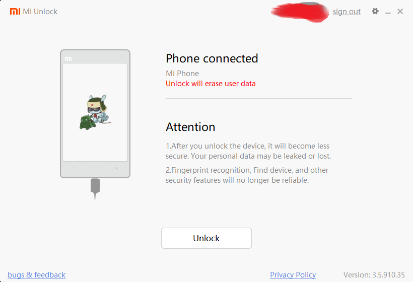
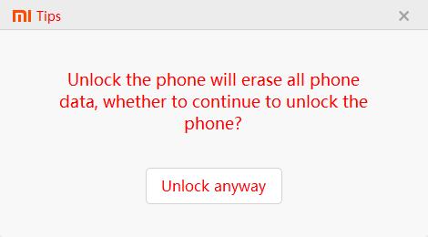
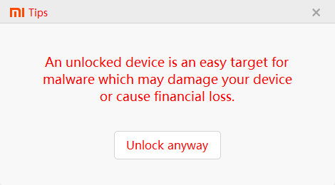
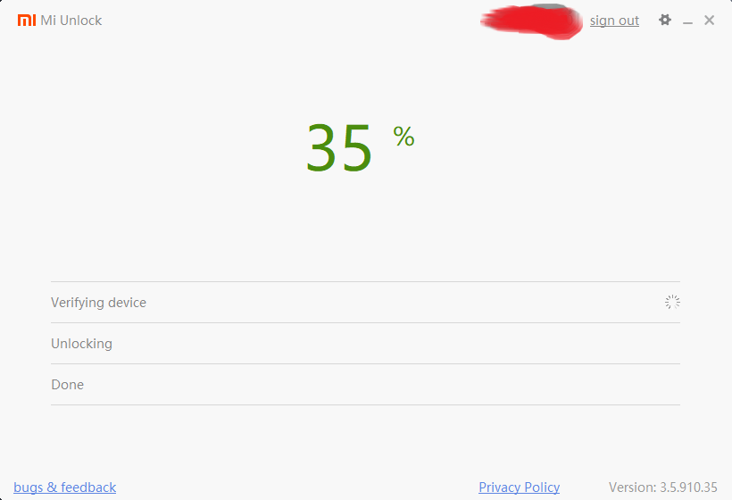
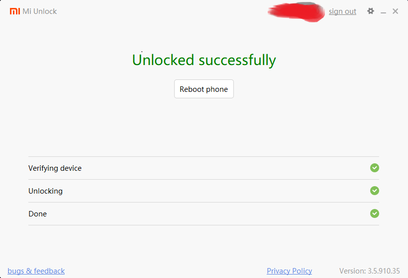

## Preparation on phone for unlock

1. Go to Settings > Mi Account, and note down your mi account number and password
    Mi account number consist of a string of digits
    The password is your personal password sat by you
2. Go to Settings > Additional Settings > Developer options (google how to enable developer settings on redmi)
3. Enable OEM unlocking
4. Navigate into "Mi Unlock status" and follow the steps
5. Go to Settings > Mi Account > Mi cloud, and turn on "Find device"

Now you phone is ready to be unlocked.

*But your PC is probably not yet.*

## Preparation on PC for unlock
1. Go to https://en.miui.com/unlock/download_en.html and download the mi unlock tool. "miflash_unlock-en-3.5.910.35" version is proved working 2019/11/15
2. Unzip the file and `miflash_unlock.exe`
3. Login with your mi account number and password
4. Connect your phone to the PC and start FASTBOOT mode (holding down volume down and powerbutton)

5. You should see the following image.

6. Press "Unlock" and there will be a countdown for 5 seconds. Press "Unlock anyway".

7. Do it again for each popup.

If you are doing this for the first time, you will encounter a popup telling you to wait for 168 or 360 hours (or more) before attempting to unlock the phone. That's the policy of Xiaomi restricting its users from unlocking their phone to stop criminals from unlocking stolen phones. There are no other way around, you will just have to wait for 1 or 2 weeks and retry.

8. The unlocking process starts.

While the PC is showing the progress.
The phone will show a percentage process and should be done in like 10 seconds.
Then it reboots, spending like 1-2 minutes to reboot.

In meanwhile, the PC shows

There is NO need to press "Reboot Phone".

9. Exit Mi Unlock application.

10. Setup the phone by following the instructions on screen.

# Now install Magisk Manager

1.

Download Magiskv19.3.zip, and place it into phone

# Sources
https://www.technobuzz.net/how-to-install-adb-and-fastboot-on-windows/
https://www.youtube.com/watch?v=DVbpYLDcy0Y remember to look at video description
