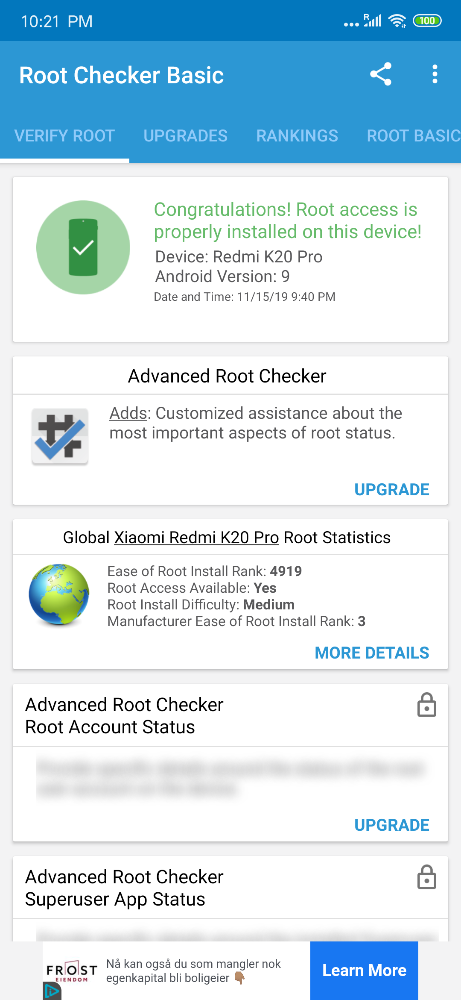

## Preparation on phone for unlock (10 minutes)

1. Go to Settings > Mi Account, and note down your mi account number and password
    Mi account number consist of a string of digits
    The password is your personal password sat by you
2. Go to Settings > Additional Settings > Developer options (google how to enable developer settings on redmi)
3. Enable OEM unlocking
4. Navigate into "Mi Unlock status" and follow the steps
5. Go to Settings > Mi Account > Mi cloud, and turn on "Find device"

    Now you phone is ready to be unlocked.

    *But your PC is probably not yet.*

## Preparation on PC for unlock (might take weeks for finish)
1. Go to https://en.miui.com/unlock/download_en.html and download the mi unlock tool. "miflash_unlock-en-3.5.910.35" version is proved working 2019/11/15
2. Unzip the file and `miflash_unlock.exe`
3. Login with your mi account number and password
4. Connect your phone to the PC and start FASTBOOT mode (holding down volume down and powerbutton)

5. You should see the following image.  

    

6. Press "Unlock" and there will be a countdown for 5 seconds. Press "Unlock anyway".  
    

7. Do it again for each popup.  
      

    If you are doing this for the first time, you will encounter a popup telling you to wait for 168 or 360 hours (or more) before attempting to unlock the phone. That's the policy of Xiaomi restricting its users from unlocking their phone to stop criminals from unlocking stolen phones. There are no other way around, you will just have to wait for 1 or 2 weeks and retry.

8. The unlocking process starts.  
    

    While the PC is showing the progress.  

    The phone will show a percentage process and should be done in like 10 seconds.  
    Then it reboots, spending like 1-2 minutes to reboot.  
    In meanwhile, the PC shows  

      

    There is NO need to press "Reboot Phone".  

9. Exit Mi Unlock application.

10. Setup the phone by following the instructions on screen.

## Install OrangeFox (a version of TWRP) (10 minutes)
1. Download OrangeFox from https://files.orangefox.tech/OrangeFox-Stable/raphael/OrangeFox-R10.0-3-Stable-raphael.zip. You can possible pick other versions of Raphael, but 10.0.3 is proven working.
2. Download platform_tools from google https://dl.google.com/android/repository/platform-tools_r29.0.5-windows.zip
3. Unzip both the files.
4. Copy the recovery.img from orangefox zip into platform_tools folder (extracted folder).  

    

5. Connect your phone to the PC and start FASTBOOT mode (holding down volume down and powerbutton)

6. Open Command Prompt (path must be inside platform_tools) and run `fastboot devices` to check if the phone is correctly connected to the PC. If you phone is properly connected, it will return `<deviceID> fastboot`. Else if your phone is NOT properly connected, it will show nothing.

7. Run `fastboot flash recovery recovery.img`. In about 3 seconds, your phone will now have TWRP installed.  
    If you have done it correctly, your CMD window should look like this.  

      

    Now you will need to run TWRP.

8. While the phone is still showing "FASTBOOT", hold down volume up and powerbutton until the phone reboots into OrangeFox.

9. Follow orangefox instructions.
    If it prompts you a password, you will have to type you pattern lock, pin or password you sat for your device. The password you use to unlock your device every you turn on the screen.

10. Swipe the "Swipe to allow Modifications"

11. Copy the OrangeFox zip you downloaded (not extracted) into the phone internal storage.  

    

12. Wait or change tabs and back to File tab, click on the zip file you moved into the phone.

13. Swipe to install.

14. After waiting, you are back to the OrangeFox. Navigate to `Menu > Manage Partitions > Data`, and press `Format Data` button.

15. Confirm by typing "yes" manually.

16. Wait, then press `Reboot System` button.

    #### We have now installed OrangeFox TWRP and it is accessible at `holding down Volume Up + Power button`.

## Enable Google Services and Google Play Services
1. Go to the app called App Store, start it and accept terms of service.
2. Search for "google play store" and press Update button. This will install it on the phone.
3. Then press the "Open" button to open Play Store app.
4. Sign in to your personal Google account.
5. Now install other Google Apps you want, such as Maps, Gmail, Chrome, Keep and Calendar.

## Now install Magisk Manager (3 minutes)
1. Download Magiskv19.3.zip, and place it into phone's internal storage
2. Run TWRP by `holding down Volume Up + Power button`.
3. In the File tab, find Magiskv19.3.zip and press on it.
4. Swipe to install.
5. Press `Reboot System` button.
6. Now you should find an app called `Magisk Manager` among your apps.
7. Open the app and **DO NOT** update any of the modules. You screen should look like this.  

    

    Now you have finally rooted your phone. Or maybe not? Lets check the root status.  

8. Go to Play Store and install Root Checker.  

    

9. Run the app and press Verify root. There will be a popup prompting for superuser rights. Give it the rights.  

    
    

    #### We have now successfully verified that we have correctly rooted a Redmi K20 Pro.

## Enable Google Location History with Magisk
In China, Location Reporting and Location History are not available. These services can be useful for Google Maps Location Sharing, and Google Fit location history reports. Enabling this feature can let you watch your own timeline of collected GPS data. Follow this guide to enable this for a Chinese phone like Xiaomi Redmi K20 Pro.

# Sources
 - https://www.technobuzz.net/how-to-install-adb-and-fastboot-on-windows/
 - https://www.youtube.com/watch?v=DVbpYLDcy0Y remember to look at video description
